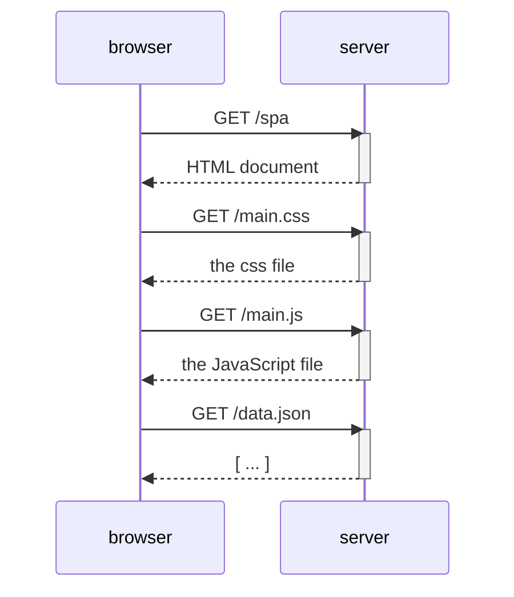

```mermaid
sequenceDiagram
    participant browser
    participant server

    browser->>server: GET /spa
    activate server
    server-->>browser: HTML document
    deactivate server

    browser->>server: GET /main.css
    activate server
    server-->>browser: the css file
    deactivate server

    browser->>server: GET /main.js
    activate server
    server-->>browser: the JavaScript file
    deactivate server

    browser->>server: GET /data.json
    activate server
    server-->>browser: [ ... ]
    deactivate server
```